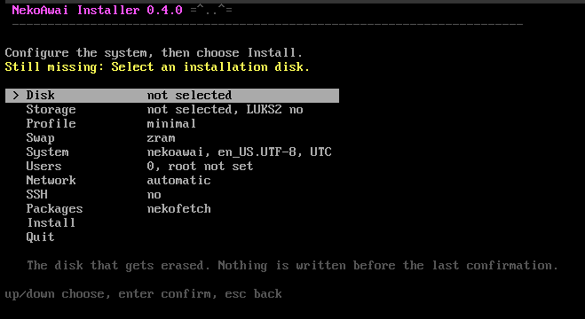

# nekoawai-install

=^..^=

**The Live-environment installer for [NekoAwai](https://github.com/nekoawai-linux/nekoawai-linux): an editable configuration menu, and one disk written only after you name it.**

Nothing to type but the answers, and nothing hidden behind a progress bar.

## What it installs

- UEFI with systemd-boot
- whole-disk GPT layout, a 512 MiB ESP and one root partition
- ext4 or btrfs, with an `@` subvolume and `compress=zstd:1` on btrfs
- optional LUKS2 on the root
- zram, a swap file, or no swap
- Minimal, or one of Niri, Hyprland, GNOME, Plasma and Xfce
- regular users, root password or a locked root, NetworkManager and optional SSH

## Running it

Run `nekoawai-install` as root from the NekoAwai Live environment. It draws
its own full-screen menus, so it needs no TUI library and stays readable on a
console that has only the built-in font. Arrow keys move, Enter confirms, Esc
goes back.

The menu says what is still missing while it is still fixable, every entry
explains itself in a line, and the install shows each step with the time it
took.

The package screen has two halves. **NekoAwai packages** is what the
distribution writes itself -- `nekowall` on a desktop, `nekofetch` on any
system -- ticked when the screen opens and taken off with Space. A package
marked off is not installed at all: the patterns recommend rather than
require them, and the installer locks the refused ones for the length of the
transaction so a recommendation cannot bring one back. The lock is lifted
before the system is handed over; the answer was given once, it is not a ban.

Anything else can be searched for by name: the screen takes a word, lists
what the repositories have with a summary each, and Space marks the ones to
install. The package list is fetched once, on the first search, into
`NEKO_INDEX_ROOT` (`/var/tmp/nekoawai-index` by default) -- the Live system
carries packages, not an index, so there is nothing to search until then.

The disk is destroyed only after a complete summary and a second confirmation
that names the disk. Nothing is written before that. The list offers only what
can hold a system: the medium the installer booted from is left out, along
with the Live system's own compressed swap, ram and loop devices, the optical
drive and the empty floppy a hypervisor invents out of nothing. A disk too
small for the chosen profile is refused while the answer is still a different
disk, rather than eight minutes into the package step.

Choosing a console keymap loads it there and then. Every password typed after
that point is typed on it, and one entered under the wrong layout is not the
password that gets stored -- which shows up at the first login, the one moment
there is nothing left to fix it with. The same choice is written into the
installed system for graphical sessions as well as for the text console.

Signatures are checked against the keys the medium carries. Nothing imports a
key from the network it is then used to vouch for, so upstream packages are
verified or the install stops.

Everything the installer runs is shown on screen and copied to
`/tmp/nekoawai-install.log`. All screens are English, and the installer runs
under `C.UTF-8` so the tools it calls answer in English as well.

    nekoawai-install            interactive installation
    nekoawai-install --text     line-oriented path, for automated image tests
    nekoawai-install --version

The target RPM repository is read from `NEKO_TARGET_REPO`, which defaults to
`/run/nekoawai/repo`. Upstream packages come from `NEKO_CORE_REPO`, and the
searchable package list is kept in `NEKO_INDEX_ROOT`.

## Packaging

    make check                          syntax, shellcheck, ASCII screens, --version
    make install DESTDIR=/tmp/root      install into a packaging root
    make dist                           reproducible release archive

The installer's version is independent from the NekoAwai release. The
archive produced by `make dist` is what
[nekoawai-linux](https://github.com/nekoawai-linux/nekoawai-linux) packages;
it must not be installed into the target system.

## Contributing

Partitioning, filesystems, package installation, system configuration,
initramfs and the bootloader stay separate from presentation. Adding a screen
should not mean touching a disk operation.

Screens are ASCII only: the Live console carries the built-in font and
nothing else, and `make check` fails on any byte outside it. Keep disks,
passwords, errors and destructive confirmation in plain, direct language.

## License

Copyright (c) 2026 shizukiq. GPL-3.0-or-later; see `LICENSE`.

[donate in TON](https://tonviewer.com/UQAj-bErFKSDkHqy_5RSwkKxmkE3RgATMLFHp-TYX5JN2kHe)
